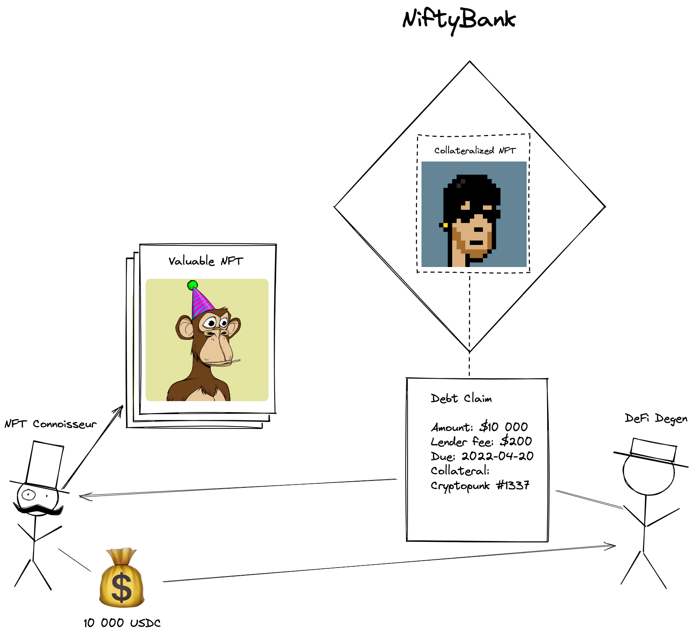

# NiftyBank 0x hackathon project

NiftyBank allows you to get a loan by collateralizing you valuable NFTs, allowing other people to lend you money in a fixed fee, fixed term loan completely peer-to-peer. If you don't pay back your debt before the expiration the lenders keeps your NFT.

